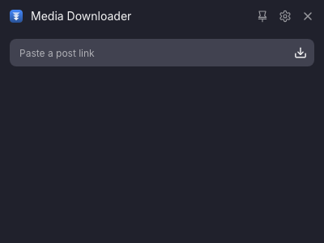
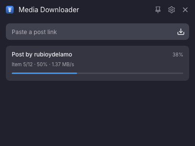
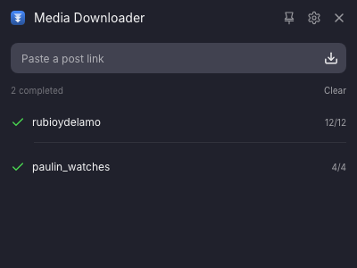
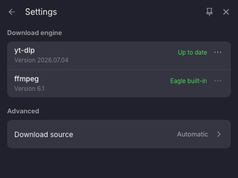

# Eagle Media Downloader

[English](./README.en.md) | 中文

将公开帖子中的图片和视频下载并导入 [Eagle](https://eagle.cool/)。当前开发预览版重点支持 Instagram Post 与 Carousel，并保留上游项目基于 [yt-dlp](https://github.com/yt-dlp/yt-dlp) 的视频下载能力。

**[下载 v0.1.0 Development Preview](https://github.com/hi-XC/eagle-media-downloader/releases/tag/v0.1.0)**

> 当前版本已在 macOS 与 Eagle 4.0 中测试。Windows 完整测试尚未完成。

## 当前支持范围

| 内容 | 状态 |
| --- | --- |
| Instagram 公开 Post | 支持图片与视频 |
| Instagram 公开 Carousel | 支持纯图片、纯视频与混合内容 |
| 其他 yt-dlp 视频网站 | 保留上游下载能力，未逐一验证 |
| 私密、登录后可见或受限内容 | 不支持 |
| 浏览器 Cookie | 不读取 |

## 功能

- 按原帖顺序分别导入 Carousel 中的图片和视频
- 显示解析状态、总体进度和当前项目进度
- 单项失败时保留其他成功素材
- 下载完成后自动导入 Eagle，并保留来源信息
- 支持窗口置顶、中英文界面和浅色/深色主题
- 不自动添加平台标签

## 界面

| 输入链接 | 下载进度 |
| --- | --- |
|  |  |

| 下载完成 | 设置 |
| --- | --- |
|  |  |

## 安装

需要 Eagle 4.0 或更高版本，并保持网络连接。

1. 打开 [v0.1.0 Release](https://github.com/hi-XC/eagle-media-downloader/releases/tag/v0.1.0)。
2. 在 `Assets` 中下载 `eagle-media-downloader-v0.1.0.eagleplugin`。
3. 打开安装包，按 Eagle 的提示完成安装。

安装包不会预置 `yt-dlp` 或 `ffmpeg`。首次运行时，插件会下载 `yt-dlp`；处理音视频时优先使用 Eagle 内置的 `ffmpeg`。

## 使用

1. 复制公开帖子链接。
2. 将链接粘贴到插件输入框。
3. 点击下载按钮。
4. 等待素材导入 Eagle。

## 开发

```bash
npm install
npm test
npm run build
npm run package
```

源代码位于 `js/`，构建后的 Eagle 插件位于 `Plugin/`。项目使用 esbuild、i18next 与 yt-dlp。后续计划见 [ROADMAP.md](./ROADMAP.md)。

## 问题反馈

在 [GitHub Issues](https://github.com/hi-XC/eagle-media-downloader/issues) 提交问题时，请说明操作系统、Eagle 版本、插件版本和错误提示。公开链接仅在确认可以公开分享时提供。

## 许可证与使用范围

本项目使用 MIT 许可证，完整版权声明见 [LICENSE](./LICENSE)。

软件许可证不授予任何第三方素材的使用权。请仅下载有权保存和使用的公开素材，并遵守相关平台条款和适用法律。

## 致谢

项目由 XC 维护，基于 [fansanqiu/eagle-video-downloader](https://github.com/fansanqiu/eagle-video-downloader) 开发；该项目源自 [OlivierEstevez/eagle-twitter-video-downloader](https://github.com/OlivierEstevez/eagle-twitter-video-downloader)。感谢上游维护者及贡献者的工作。

第三方组件及运行时依赖说明见 [THIRD_PARTY_NOTICES.md](./THIRD_PARTY_NOTICES.md)。
